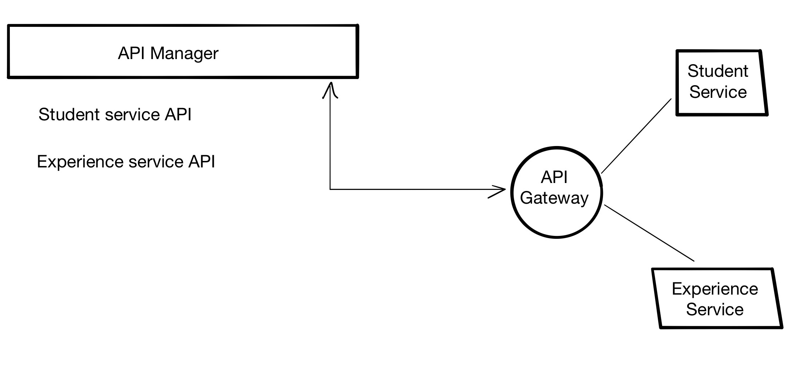

# API Platform example

There are two API implementations under `scr`: `student` and `experience`.

They are a basic nodejs applicacion serving a dummy API with CRUD operations over an in-memory array.

The concept is to create to virtual machines with those implementations and merge them with and API Gateway.

Use API Manager to show features of API Platform.




## TODOs
Improve systemd service script: user, permissions, etc


## Requirements
You need nodejs >10.x installed on each machine.
From a clean Oracle Linux:
```
sudo yum install -y gcc-c++ make

curl -sL https://rpm.nodesource.com/setup_12.x | sudo -E bash -

sudo yum install -y nodejs
```
>If you have Node already installed on the machine, it would be a good idea to clean up first:
```
sudo yum remove -y nodejs npm
```

Check the version of your Node JS installation:
```
node -v
```

## Run services locally

Go to `src/students`, it will be the same steps for `experience`:
- Install dependencies
```
npm install
```
- Run the service
```
npm start
```

You can change the port (3000 by default) with a environment variable `PORT` like this:
```
PORT=4000 npm start
```

To detach the execution from the console in our student service:
```
nohup npm start &> student.log&
```

Test the health of the service with:
```
curl -s http://PUBLIC_IP:3000/health | jq .
```

## Deploy services

You can move `src/student` and `src/experience` to the remote machines with `scp`:
>Remove `node_modules` first or it will take a while to send hundreds of files ;)
- For student app
```
scp -r src/student opc@<PUBLIC_IP>:/home/opc/
```
- For experience app
```
scp -r src/experience opc@<PUBLIC_IP>:/home/opc/
```

### Open firewall port
You must open the port you are going to use at Subnet level with `Security list`.
- Create a Security list from your Virtual Cloud Network
- Add Ingress rule

| Source    | Proto | Source port | Destination port | Allows                      |
| --------- | ----- | ----------- | ---------------- | --------------------------- |
| 0.0.0.0/0 | TCP   | All         | 3000             | TCP traffic for ports: 3000 |
- Add Egress rule

| Destination | Proto | Source port | Destination port | Allows                     |
| ----------- | ----- | ----------- | ---------------- | -------------------------- |
| 0.0.0.0/0   | TCP   | 3000        | All              | TCP traffic for ports: All |
- Add Security list to your subnet

You must add a local firewall rule in each machine like this to open the port 3000 for ingress and egress:
```
sudo iptables -I INPUT -p tcp --dport 3000 -m conntrack --ctstate NEW,ESTABLISHED -j ACCEPT

sudo iptables -I OUTPUT -p tcp --sport 3000 -m conntrack --ctstate ESTABLISHED -j ACCEPT
```